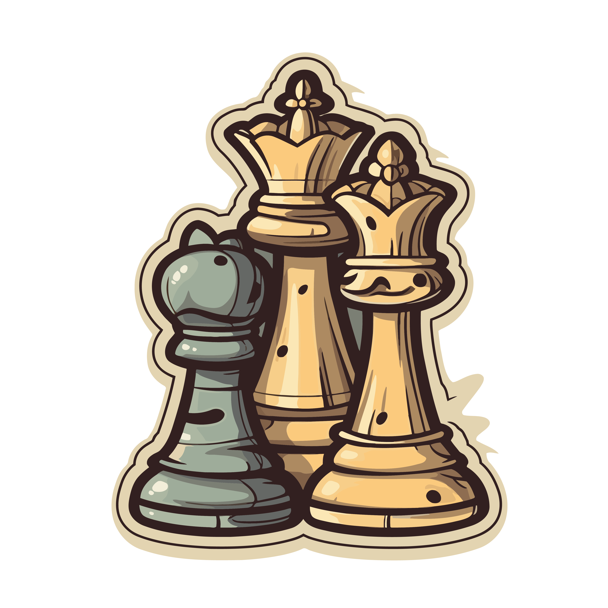

<p align="center">
  <a>
    
  </a>
</p>
<h1 align="center">Chess System</h1>
<p align="center">This chess game system was made in Java. The game is complete, and all chess rules are implemented. The game runs in the terminal.</p>  

## Topics covered
#### OOP Topics:
    - Encapsulation / Access Modifiers
    - Constructors
    - ToString (Object / overriding)
    - Associations
    - Enumerations
    - Inheritance
    - Downcasting
    - Static members
    - Layers pattern
    - Overriding
    - Polymorphism
    - Exceptions
    - Abstract method / class
#### Data Structures Topics:
    - Matrix
    - List

## Chess system design
<p align="center">
  <a>
    
  </a>
</p>

## Prerequisites
You need the following installed on your machine: [Java JDK](https://www.oracle.com/java/technologies/downloads/).

## How to play
To play, choose a piece (example: e2), and choose the target of the piece (example: e4).

### Compiling and running

```bash
# Clone this repository.
$ git clone <https://github.com/01davisouzaF/chess-system-java.git>

# Run the game from the Program file.
$ src/application/Program.java